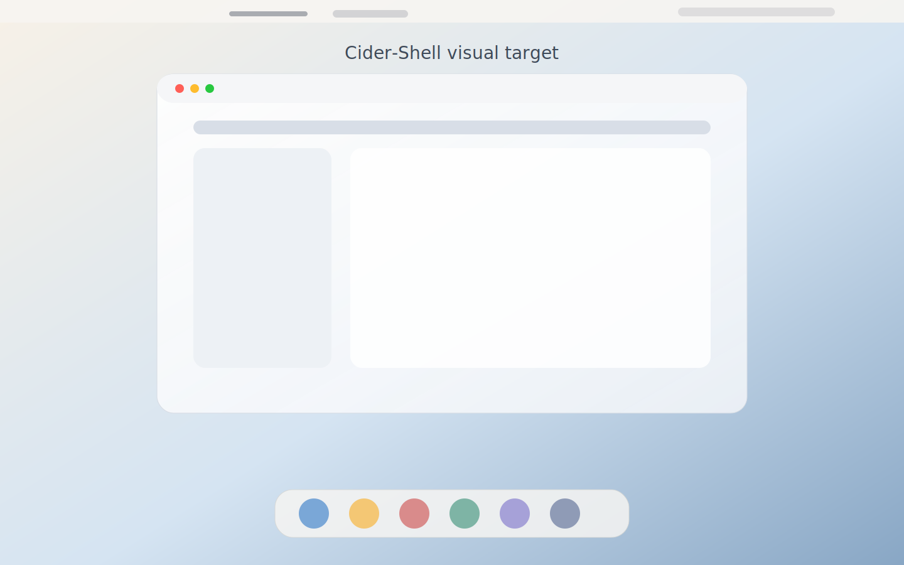

<div align="center">

# Cider-Shell

### macOS-style desktop polish for Ubuntu 24.04 + GNOME

<br>

**[→ Run the local installer](./scripts/install.sh)**

<br>

[]()
[]()
[]()
[](./LICENSE)

</div>



---

## What is Cider-Shell?

Cider-Shell is a **copy-paste-friendly desktop setup repo** that transforms Ubuntu 24.04 + GNOME into a cleaner macOS-style environment. It installs the WhiteSur theme stack, applies GNOME settings, tunes the dock, refines fonts, and adds a post-install polish layer for extensions like `Just Perfection` and `Blur my Shell`.

It is designed for users with Ubuntu in English or Spanish. The automated setup uses terminal commands and `gsettings`, so it does not depend on translated menu names. Manual extension steps are documented in both languages.

---

## Why it matters

Getting Ubuntu to feel convincingly Mac-like usually turns into scattered blog posts, half-compatible GNOME extension advice, and manual `gsettings` tweaks that are hard to reproduce later. Without a structured setup:

- Themes, icons, cursors, dock settings, and shell styling are applied inconsistently
- Extension tweaks break depending on whether they were installed globally or in `~/.local/share/gnome-shell/extensions`
- Useful quality-of-life details like fonts, terminal appearance, touchpad behavior, and shortcuts are left unfinished

Cider-Shell packages that work into a reproducible repo.

---

## How it works

### 1. Install

Run the installer:

```bash
cd ~/github/Cider-Shell
./scripts/install.sh
```

This installs the base GNOME tools, the WhiteSur theme stack, bundled wallpapers, and the main system settings.

### 2. Enable extensions

Open `Extension Manager` or `Administrador de extensiones` and install:

- `User Themes`
- `Just Perfection`
- `Blur my Shell`

Then apply the extension-aware polish:

```bash
cd ~/github/Cider-Shell
./scripts/post-install.sh
```

### 3. Verify

Run the built-in checker:

```bash
cd ~/github/Cider-Shell
./scripts/check.sh
```

It validates theme, dock, shell styling, fonts, touchpad behavior, shortcuts, terminal settings, and extension state.

### 4. Fine-tune

Optional finishing steps and bilingual extension notes live here:

- [docs/extension-manager-guide.md](/home/ebald/github/Cider-Shell/docs/extension-manager-guide.md)
- [docs/visual-finishing.md](/home/ebald/github/Cider-Shell/docs/visual-finishing.md)

---

## What it changes

| Area | Result |
|---|---|
| Theme | `WhiteSur-Light` GTK + shell styling |
| Icons and cursor | `WhiteSur` icons + `WhiteSur-cursors` |
| Fonts | `Noto Sans` and `Noto Sans Mono` |
| Dock | bottom position, auto-hide, compact Mac-like shape |
| Top bar | cleaner layout, centered clock through `Just Perfection` |
| Blur | glass-like panel and dock via `Blur my Shell` |
| Files | Finder-like list view in Nautilus |
| Terminal | light profile, larger font, cleaner defaults |
| Input | natural scroll, finger-based touchpad click behavior |
| Shortcuts | `Super+W`, `Super+M`, `Super+T`, `Super+N` |

---

## Features

| | |
|---|---|
| **Copy-paste setup** | Install and configure the desktop with shell scripts and `gsettings` |
| **Bilingual-friendly** | Works for Ubuntu users in English or Spanish |
| **Theme stack included** | WhiteSur GTK, icons, and cursors installed automatically |
| **Extension-aware polish** | Supports `User Themes`, `Just Perfection`, and `Blur my Shell` |
| **System verification** | `check.sh` confirms what applied and what is still missing |
| **Bundled wallpapers** | Includes project wallpapers and a wallpaper apply script |
| **Safe rollback** | `uninstall.sh` resets GNOME settings changed by the repo |
| **Reproducible result** | Captures the exact desktop polish applied on a real Ubuntu system |

---

## Included scripts

| Script | Purpose |
|---|---|
| `./scripts/install.sh` | Main installer for themes, packages, dock, fonts, shortcuts, terminal, and wallpaper |
| `./scripts/post-install.sh` | Reapplies extension-aware polish after enabling GNOME extensions |
| `./scripts/check.sh` | Validates the current desktop state |
| `./scripts/apply-wallpaper.sh` | Applies a bundled wallpaper or a custom local file |
| `./scripts/uninstall.sh` | Reverts GNOME settings changed by Cider-Shell |

---

## Preview and wallpapers

The repo includes a visual preview and bundled wallpapers:

```text
Cider-Shell/
├── assets/previews/cider-shell-preview.svg
└── assets/wallpapers/
    ├── daybreak.svg
    └── tide.svg
```

Apply one of them:

```bash
cd ~/github/Cider-Shell
./scripts/apply-wallpaper.sh daybreak.svg
```

List available wallpapers:

```bash
cd ~/github/Cider-Shell
./scripts/apply-wallpaper.sh --list
```

---

## Requirements

| Requirement | Notes |
|---|---|
| Ubuntu | Tested on Ubuntu 24.04 |
| GNOME | Tested on GNOME 46 |
| Internet access | Needed to download WhiteSur repositories during install |
| Sudo access | Required for package installation |

---

## Project structure

```text
Cider-Shell/
├── README.md
├── LICENSE
├── assets/
│   ├── previews/
│   └── wallpapers/
├── docs/
│   ├── extension-manager-guide.md
│   └── visual-finishing.md
└── scripts/
    ├── apply-wallpaper.sh
    ├── check.sh
    ├── install.sh
    ├── post-install.sh
    └── uninstall.sh
```

---

## Troubleshooting

- `Shell theme did not change`
  Install and enable `User Themes`, run `./scripts/post-install.sh`, then log out and back in.
- `Extensions are enabled but the check still fails`
  Run `./scripts/check.sh` again. Current versions inspect both GNOME schemas and local extension installs in `~/.local/share/gnome-shell/extensions`.
- `Blur my Shell or Just Perfection settings were skipped`
  Install and enable the extension first, then rerun `./scripts/post-install.sh`.
- `Wallpaper did not update`
  Run `./scripts/apply-wallpaper.sh daybreak.svg` manually and relog if needed.
- `I want to revert the setup`
  Run `./scripts/uninstall.sh`. This resets GNOME settings but does not remove installed packages or theme files from disk.

---

## Notes

- Ubuntu usually exposes dock settings through `ubuntu-dock`, while some GNOME systems use `dash-to-dock`
- The repo is intentionally non-destructive and avoids deleting theme or extension files
- Some shell changes appear only after logging out or rebooting

---

## Spanish

`Cider-Shell` convierte Ubuntu 24.04 + GNOME en un escritorio más parecido a macOS con una instalación reproducible desde terminal.

Flujo recomendado:

```bash
cd ~/github/Cider-Shell
./scripts/install.sh
./scripts/post-install.sh
./scripts/check.sh
```

Extensiones recomendadas en `Administrador de extensiones`:

- `User Themes`
- `Just Perfection`
- `Blur my Shell`

Guías bilingües:

- [docs/extension-manager-guide.md](/home/ebald/github/Cider-Shell/docs/extension-manager-guide.md)
- [docs/visual-finishing.md](/home/ebald/github/Cider-Shell/docs/visual-finishing.md)

---

## Author

**Emiliano Balderas Ramírez**

[](https://github.com/ebalderasr)

---

<div align="center"><i>Cider-Shell — make Ubuntu feel sharper, calmer, and closer to macOS.</i></div>
