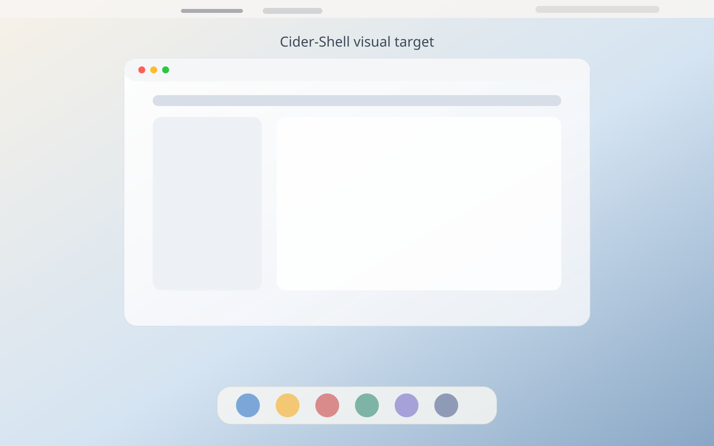

<div align="center">

# Cider-Shell

### macOS-style desktop polish for Ubuntu + GNOME

<br>

**[→ Clone and install locally](https://github.com/ebalderasr/Cider-Shell.git)**

<br>

[]()
[]()
[]()
[](./LICENSE)

</div>



---

## What is Cider-Shell?

Cider-Shell is a **copy-paste-friendly desktop setup repo** that transforms Ubuntu + GNOME into a cleaner macOS-style environment. It installs the WhiteSur theme stack, applies GNOME settings, tunes the dock, refines fonts, and adds a post-install polish layer for extensions like `Just Perfection` and `Blur my Shell`.

It is designed for users with Ubuntu in English or Spanish. The automated setup uses terminal commands and `gsettings`, so it does not depend on translated menu names. Manual extension steps are documented in both languages.

---

## Why it matters

Getting Ubuntu to feel convincingly Mac-like usually turns into scattered blog posts, half-compatible GNOME extension advice, and manual `gsettings` tweaks that are hard to reproduce later. Without a structured setup:

- Themes, icons, cursors, dock settings, and shell styling are applied inconsistently
- Extension tweaks break depending on whether they were installed globally or in `~/.local/share/gnome-shell/extensions`
- Useful quality-of-life details like fonts, terminal appearance, touchpad behavior, and shortcuts are left unfinished

Cider-Shell packages that work into a reproducible repo.

---

## How it works

### 1. Clone the repo

If you do not have the repo yet:

```bash
mkdir -p ~/github
git clone https://github.com/ebalderasr/Cider-Shell.git ~/github/Cider-Shell
cd ~/github/Cider-Shell
```

### 2. Install

Run the installer:

```bash
./scripts/install.sh
```

This installs the base GNOME tools, the WhiteSur theme stack, bundled wallpapers, the main system settings, `User Themes`, `Just Perfection`, `Blur my Shell`, and Chromium launcher overrides for installed Chrome/Brave browsers on Wayland sessions so they are more likely to use system-style window controls.

### 3. Reload GNOME Shell

The installer downloads, installs, enables, and configures the recommended GNOME extensions automatically. Log out and back in, or reboot, so GNOME Shell fully reloads newly installed extensions.

If you install or update extensions later, reapply the extension-aware polish:

```bash
./scripts/post-install.sh
```

### 4. Verify

Run the built-in checker:

```bash
./scripts/check.sh
```

It validates theme, dock, shell styling, fonts, touchpad behavior, shortcuts, terminal settings, and extension state.

### 5. Fine-tune

Optional finishing steps and bilingual extension notes live here:

- [docs/extension-manager-guide.md](docs/extension-manager-guide.md)
- [docs/visual-finishing.md](docs/visual-finishing.md)

---

## What it changes

| Area | Result |
|---|---|
| Theme | `WhiteSur-Light` GTK + shell styling |
| Icons and cursor | `WhiteSur` icons + `WhiteSur-cursors` |
| Fonts | `Noto Sans` and `Noto Sans Mono` |
| Dock | bottom position, auto-hide, compact Mac-like shape |
| Top bar | cleaner layout, centered clock through `Just Perfection` |
| Blur | glass-like panel and dock via `Blur my Shell` |
| Files | Finder-like list view in Nautilus |
| Terminal | light profile, larger font, cleaner defaults |
| Input | natural scroll, finger-based touchpad click behavior |
| Shortcuts | `Super+W`, `Super+M`, `Super+T`, `Super+N` |
| Chromium browsers on Wayland | local launchers force `--ozone-platform=x11` for more consistent system title bars in Chrome and Brave |

---

## Features

| | |
|---|---|
| **Copy-paste setup** | Install and configure the desktop with shell scripts and `gsettings` |
| **Bilingual-friendly** | Works for Ubuntu users in English or Spanish |
| **Theme stack included** | WhiteSur GTK, icons, and cursors installed automatically |
| **Extension-aware polish** | Automatically installs and configures `User Themes`, `Just Perfection`, and `Blur my Shell` |
| **System verification** | `check.sh` confirms what applied and what is still missing |
| **Bundled wallpapers** | Includes project wallpapers and a wallpaper apply script |
| **Safe rollback** | `uninstall.sh` resets GNOME settings changed by the repo |
| **Reproducible result** | Captures the exact desktop polish applied on a real Ubuntu system |

---

## Included scripts

| Script | Purpose |
|---|---|
| `./scripts/install.sh` | Main installer for themes, packages, dock, fonts, shortcuts, terminal, and wallpaper |
| `./scripts/post-install.sh` | Reapplies extension-aware polish after enabling GNOME extensions |
| `./scripts/check.sh` | Validates the current desktop state |
| `./scripts/apply-wallpaper.sh` | Applies a bundled wallpaper or a custom local file |
| `./scripts/uninstall.sh` | Reverts GNOME settings changed by Cider-Shell |

---

## Preview and wallpapers

The repo includes a visual preview and bundled wallpapers:

```text
Cider-Shell/
├── assets/previews/cider-shell-preview.svg
└── assets/wallpapers/
    ├── daybreak.svg
    └── tide.svg
```

Apply one of them:

```bash
./scripts/apply-wallpaper.sh daybreak.svg
```

List available wallpapers:

```bash
./scripts/apply-wallpaper.sh --list
```

---

## Requirements

| Requirement | Notes |
|---|---|
| Ubuntu | Built for Ubuntu desktop releases with GNOME |
| GNOME | Tested on GNOME 46; scripts guard optional keys for newer GNOME versions |
| Internet access | Needed to download WhiteSur repositories and GNOME extension packages during install |
| Sudo access | Required for package installation |

---

## Project structure

```text
Cider-Shell/
├── README.md
├── LICENSE
├── assets/
│   ├── previews/
│   └── wallpapers/
├── docs/
│   ├── extension-manager-guide.md
│   └── visual-finishing.md
└── scripts/
    ├── apply-wallpaper.sh
    ├── check.sh
    ├── install.sh
    ├── post-install.sh
    └── uninstall.sh
```

---

## Troubleshooting

- `Shell theme did not change`
  Run `./scripts/post-install.sh`, then log out and back in.
- `Extensions are enabled but the check still fails`
  Run `./scripts/check.sh` again. Current versions inspect both GNOME schemas and local extension installs in `~/.local/share/gnome-shell/extensions`.
- `Blur my Shell or Just Perfection settings were skipped`
  Rerun `./scripts/install.sh` to download missing extensions, or run `./scripts/post-install.sh` after installing them manually.
- `Chrome or Brave still show different window buttons`
  Close them fully and reopen them from the app launcher after `install.sh`. In Wayland sessions, Cider-Shell installs local desktop overrides only when the browser binary exists, then launches it with `--ozone-platform=x11` to improve title-bar consistency.
- `Wallpaper did not update`
  Run `./scripts/apply-wallpaper.sh daybreak.svg` manually and relog if needed.
- `I want to revert the setup`
  Run `./scripts/uninstall.sh`. This resets GNOME settings but does not remove installed packages or theme files from disk.

---

## Notes

- Ubuntu usually exposes dock settings through `ubuntu-dock`, while some GNOME systems use `dash-to-dock`
- The repo is intentionally non-destructive and avoids deleting theme or extension files
- Some shell changes appear only after logging out or rebooting

---

## Spanish

`Cider-Shell` convierte Ubuntu + GNOME en un escritorio más parecido a macOS con una instalación reproducible desde terminal.

Flujo recomendado:

```bash
mkdir -p ~/github
git clone https://github.com/ebalderasr/Cider-Shell.git ~/github/Cider-Shell
cd ~/github/Cider-Shell
./scripts/install.sh
./scripts/check.sh
```

El instalador descarga, instala, activa y configura automaticamente `User Themes`, `Just Perfection` y `Blur my Shell`. Despues de instalar, cierra sesion y vuelve a entrar, o reinicia, para que GNOME Shell recargue las extensiones.

Guías bilingües:

- [docs/extension-manager-guide.md](docs/extension-manager-guide.md)
- [docs/visual-finishing.md](docs/visual-finishing.md)

---

## Author

**Emiliano Balderas Ramírez**

[](https://github.com/ebalderasr)

---

<div align="center"><i>Cider-Shell — make Ubuntu feel sharper, calmer, and closer to macOS.</i></div>
